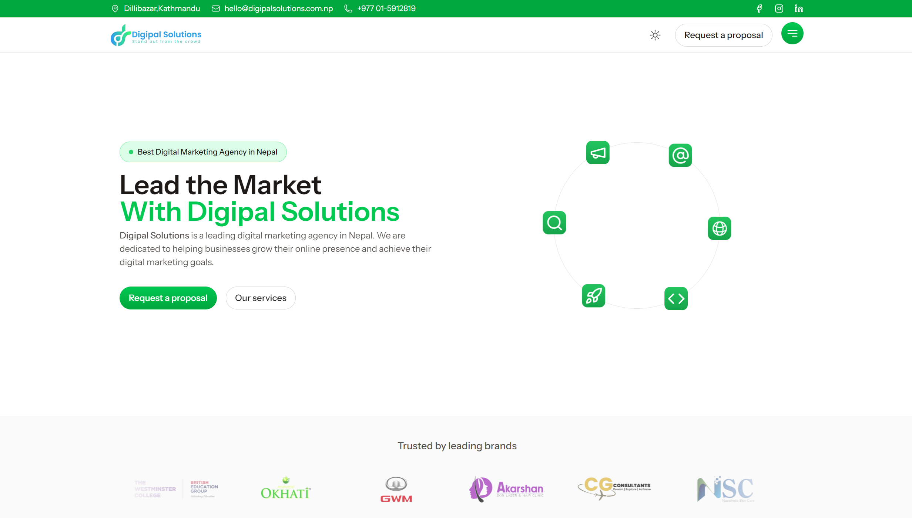

# 🌐 Digipal Solutions

 <!-- Replace with your actual banner image path -->

**Digipal Solutions** is a pioneering digital marketing agency in Nepal, dedicated to crafting innovative and impactful online experiences. Our website leverages the power of the **TALL Stack** — Tailwind CSS, Alpine.js, Laravel, and Livewire — to deliver fast, dynamic, and fully responsive interfaces.

---

## ✨ Our Expertise

We excel in:

-   📈 SEO & SEM Campaigns
-   📣 Social Media Marketing
-   💡 Branding & Creative Design
-   🛍️ E-Commerce Marketing
-   📊 Analytics and Strategy

---

## 💻 Our Technology Stack

-   **Laravel** – A robust framework for backend solutions
-   **Livewire** – Reactive components for modern user interfaces
-   **Tailwind CSS** – A utility-first CSS framework
-   **Alpine.js** – Lightweight JavaScript for interactivity
-   **Vite** – A fast asset bundler and development server

---

## 🧠 About Us

**Digipal Solutions** empowers brands to expand through strategic, design, and digital expertise. Situated in Kathmandu, Nepal, we collaborate with businesses worldwide to create compelling digital experiences.

---

## 📍 Get In Touch

-   🌍 Website: [Visit Us](https://digipalsolutions.com.np)
-   📧 Email: [Contact Us](mailto:hello@digipalsolutions.com.np)
-   📌 Location: Kathmandu, Nepal

---

## ⚖️ License

This project is licensed under the [MIT License](LICENSE).

---

> Crafted with ❤️ by Tusar Gautam
